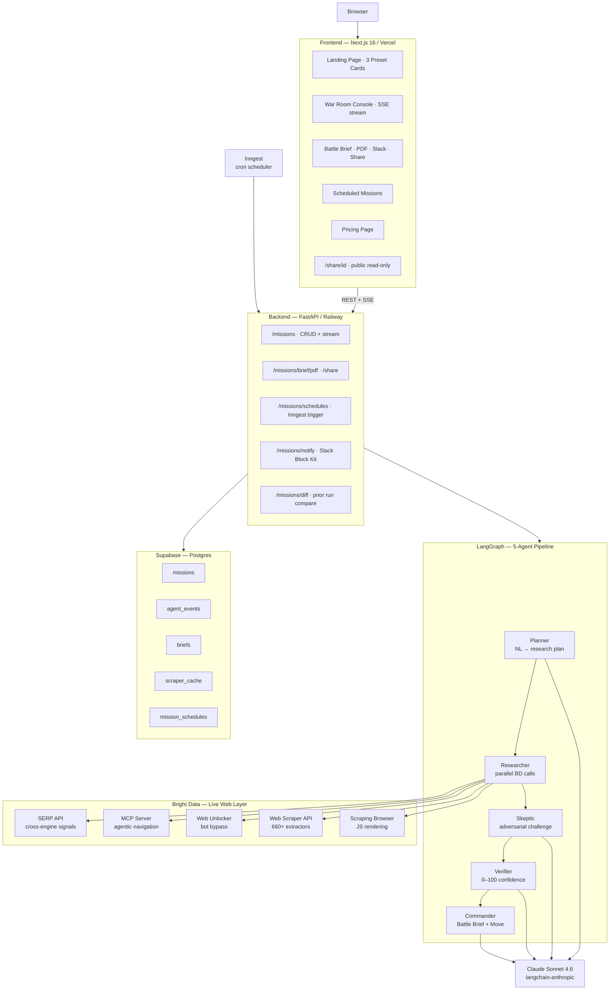

# War Room AI — Architecture

## System Diagram



---

## Layer Decisions

### Frontend — Next.js 16 App Router

Server components handle layout, metadata, and the public share page (`/share/[id]`). The War Room Console is a client component that opens an `EventSource` against the FastAPI SSE endpoint. Framer Motion drives agent card status transitions (idle → running → complete) with staggered preset card entry animations. Tailwind v4 CSS-first configuration keeps the build lean — no `tailwind.config.ts` required.

The frontend communicates exclusively over two channels: REST (mission creation, brief fetch, schedule CRUD) and SSE (live agent event stream). There is no WebSocket dependency, which simplifies Railway and Vercel deployment.

### Backend — FastAPI + uvicorn

Chosen over Node.js for LangGraph's native Python API and the Bright Data Python SDK. `sse-starlette` turns any async generator into a compliant SSE stream with zero boilerplate. The SSE architecture uses an in-memory queue per mission ID — `events.py` manages creation, subscription, and teardown. Mission IDs map to queues; the SSE route drains the queue in real time, then cleans up when the "done" sentinel arrives.

CORS is environment-aware: `localhost:3000` in development, plus a `FRONTEND_URL` env var that injects the Vercel production origin in Railway.

### Agent Pipeline — LangGraph

LangGraph's stateful graph model maps cleanly to the War Room flow: each agent is a node, state flows forward (Planner → Researcher → Skeptic → Verifier → Commander), and every node writes to a shared `MissionState` TypedDict. The Researcher node fires all plan steps in parallel via `asyncio.gather` — a 6-step plan with 5 Bright Data products completes in 9–13 seconds wall time.

Key design decisions:
- **Per-product timeout budgets** (SERP 15s, MCP 20s, Unlocker 30s, Scraper 160s, Browser 35s) prevent any single slow call from blocking the gather
- **Retry-once policy** for Unlocker and Browser (60% of original timeout on second attempt)
- **Content threshold**: results under 50 characters are classified as `empty`, not `ok` — prevents LLM hallucination from short error envelopes
- **Verifier confidence calibration**: confidence measures quality of found evidence, not percentage of steps that succeeded — a brief with 2 high-quality findings and 4 empty steps scores ~78, not 33

### Intelligence Layer — Bright Data (all 5 products)

The Researcher agent is Bright Data-native: it selects the right product per step based on what the Planner assigned, rather than applying one tool uniformly. Structured sites (LinkedIn, G2, SEC) use Web Scraper API. Protected or JS-heavy pages use Web Unlocker or Scraping Browser. Cross-engine signal discovery uses SERP API. Agentic page-level navigation uses MCP Server.

All five products fire on every mission. The Bright Data Coverage panel in the UI proves it: 5 product cards, each showing call count, cumulative latency, and last query sent.

Scraper API responses are cached in Supabase (`scraper_cache` table, 24h TTL) — LinkedIn snapshots legitimately take 1–3 minutes server-side; the cache ensures repeat missions on the same target complete in under 1 second for the Scraper step.

### LLM — Claude Sonnet 4.6 (langchain-anthropic)

Used by Planner (plan generation), Skeptic (adversarial challenge), Verifier (confidence reasoning), and Commander (brief synthesis). Each agent has a carefully tuned system prompt:

- **Planner**: 8-word SERP query hard limit (longer queries return empty); known CEO LinkedIn URLs hardcoded to prevent hallucinated slugs; mission-aware browser URLs per target
- **Verifier**: explicit confidence calibration examples in the system prompt prevent the model from conflating "3/6 steps succeeded" with confidence 50 — real confidence is quality of evidence, not step count
- **Commander**: five-tier decision framework (ESCALATE 80-95, ATTACK 65-85 with ≥3 findings, DEFEND 65-80 with ≥2 findings, WAIT 35-55, MONITOR 20-40) with explicit score boundaries

### Persistence — Supabase

Postgres stores missions, agent events, briefs, scraper cache, and mission schedules. All DB calls are synchronous (Supabase Python SDK), wrapped in `asyncio.to_thread` to stay non-blocking. The service-role key is used server-side only; the frontend uses the anonymous key for direct queries if needed.

Tables:
- `missions` — id, target, mission_type, status, created_at
- `agent_events` — mission_id, agent, event_type, message, payload, bright_data_product
- `briefs` — mission_id, market_move_score, recommended_move, confidence_score, action_pack (jsonb), bright_data_calls (jsonb), shared_at
- `scraper_cache` — target_url, dataset_id, snapshot_id, data (jsonb), created_at
- `mission_schedules` — target, mission_type, cron, label, slack_webhook_url, active, last_run_at

### Scheduler — Inngest

Inngest handles recurring mission execution. The Python SDK registers two functions:
- `missions-run` — event-triggered, runs a full mission graph on `warroom/missions.run` event
- `missions-weekly-anthropic` — cron `0 9 * * 1`, fires the Anthropic Account Pulse every Monday 9am UTC via `step.send_event`

The Inngest serve endpoint is mounted at `/api/inngest` in FastAPI via `inngest.fast_api.serve()`. The dev server command is `npx inngest-cli@latest dev -u http://localhost:8000/api/inngest`.

---

## Data Flow — One Mission End-to-End

```
User clicks "Anthropic — Account Pulse"
  → POST /missions/ {target: "anthropic.com", mission_type: "account_pulse"}
  → Mission row inserted (status: queued)
  → asyncio.create_task(_run_mission(...)) — non-blocking
  → Return {mission_id: "uuid"}

Frontend opens EventSource → GET /missions/{id}/stream
  → SSE route drains agent_events queue in real time

LangGraph graph starts:
  Planner:    Claude builds a 5-step plan (6s)
  Researcher: asyncio.gather fires all 5 BD calls in parallel
    Step 1: serp_search  → SERP API          (4.2s)
    Step 2: mcp_search   → MCP Server        (8.1s)
    Step 3: unlocker_fetch → Web Unlocker    (6.7s)
    Step 4: scraper_linkedin → Scraper API   (0ms, cache hit)
    Step 5: browser_render → Scraping Browser (9.3s)
  Skeptic:    Claude challenges findings (4s)
  Verifier:   Claude resolves, scores 78/100 (5s)
  Commander:  Claude synthesizes brief, DEFEND 72 (6s)

Brief inserted → mission status: completed → SSE done event
Frontend fetches GET /missions/{id} → renders Battle Brief
GET /missions/{id}/diff → compares to prior Anthropic run → shows diff panel
```

Total wall time: **9–13 seconds**.
