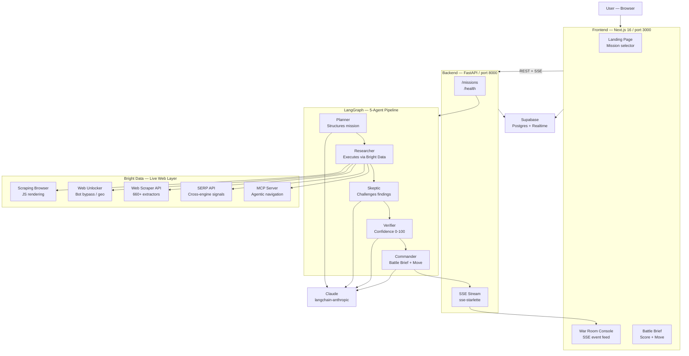

# War Room AI — Architecture

## System Diagram

---

## Layer Decisions

### Frontend — Next.js 16 App Router
Server components handle layout and metadata; the War Room Console is a client component that opens an `EventSource` against the FastAPI SSE stream. Turbopack gives sub-100ms HMR during development. Tailwind v4 CSS-first configuration keeps the build lean — no `tailwind.config.ts` needed.

### Backend — FastAPI + uvicorn
Chosen over Node for LangGraph's native Python API and the Bright Data Python SDK. `sse-starlette` turns any async generator into a compliant SSE stream with zero boilerplate. CORS is locked to `localhost:3000` in development; Day 5 replaces this with the production domain.

### Agent Pipeline — LangGraph
LangGraph's stateful graph model maps cleanly to the War Room flow: each agent is a node, state flows forward (Planner → Researcher → Skeptic → Verifier → Commander), and the Researcher node has a tool-calling loop that can invoke any of the five Bright Data products multiple times per mission. The graph state carries the full finding set across all nodes so the Commander has complete context.

### Intelligence Layer — Bright Data (all 5 products)
The Researcher agent is Bright Data-native: it selects the right product per source rather than applying one tool uniformly. Structured sites (LinkedIn, G2) get Web Scraper API. Protected or JS-heavy pages get Web Unlocker or Scraping Browser. Cross-engine signal discovery uses SERP API. Agentic page-level navigation uses MCP Server. No single product covers the full web; all five together do.

### LLM — Claude (langchain-anthropic)
Used by Planner (plan generation), Skeptic (adversarial challenge), Verifier (confidence reasoning), and Commander (synthesis). Prompt caching on the system prompt cuts latency and cost on repeated missions against the same target.

### Persistence — Supabase
Postgres stores missions, agent events, briefs, and citations. Supabase Realtime (websockets) is the Day 4 upgrade path for the frontend to subscribe to `agent_events` inserts and render the live feed without polling. Row Level Security is stubbed in `schema.sql` and enabled Day 4.
