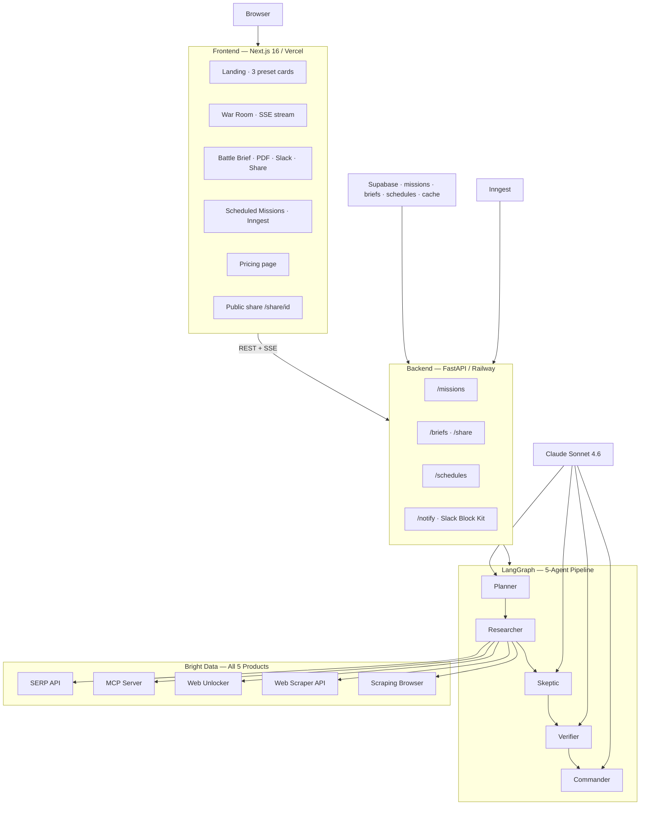

<div align="center">

# War Room AI

### Autonomous Market Battlefield for Enterprise Decision-Making

**Five agents. Five Bright Data products. Three flagship missions. One Executive Battle Brief in 15 seconds.**

[Live Demo](https://warroom-ai.vercel.app) · [3-min Video](https://youtu.be/PLACEHOLDER) · [Sample Brief](https://github.com/jpablortiz96/warroom-ai/blob/main/docs/sample-briefs/anthropic-account-pulse.md) · [Pricing](https://warroom-ai.vercel.app/pricing)


</div>

---

Every Fortune 500 has a competitive intelligence team. Most companies don't, because hiring one costs $400K/year. War Room AI deploys five autonomous agents that monitor accounts, suppliers, and threats across the live web — then deliver an Executive Battle Brief with a Market Move Score and a Recommended Move in 15 seconds. Built on Bright Data's unblockable web infrastructure, it's intelligence that scales without analysts.

---

## The Problem

Sales teams react to competitor moves weeks after the fact. Procurement learns about supplier distress from the news. Security teams discover threats after disclosure. The web has the signal in real time — pricing pages change, hiring spikes, breaches surface, filings drop — but no agent can reliably reach it. The bottleneck is not intelligence; it is access to the live web at scale, without being blocked.

Today's tools fail at different things. Perplexity gives one-shot answers but doesn't monitor. Bloomberg-style dashboards are structured but stale. Hiring an analyst costs $120K/year and produces three briefs a week. None of them deliver decisive verdicts at the speed enterprise decisions actually need. Every existing solution either lacks breadth, lacks recurrence, or lacks a committed recommendation.

War Room AI is the autonomous intelligence layer between the raw live web and the executive who needs to make a call. It runs the research. It challenges its own findings. It scores its confidence. And it commits to a recommended move — ATTACK, DEFEND, ESCALATE, MONITOR, or WAIT — with a rationale a CSO could defend to a board.

---

## Three Flagship Missions — All Three Hackathon Tracks

| Mission | Hackathon Track | Demo Target | Actual Output |
|---------|-----------------|-------------|---------------|
| **Account Pulse** | Track 1 — GTM Intelligence | anthropic.com | DEFEND · Score 72/100 · Confidence 78/100 |
| **Supplier Watch** | Track 2 — Finance & Market Intelligence | boeing.com | DEFEND · Score 72/100 · Confidence 78/100 |
| **Threat Surface** | Track 3 — Security & Compliance | change.unitedhealthgroup.com | DEFEND · Score 71/100 · Confidence 78/100 |

One engine. Three mission types. All three Bright Data hackathon tracks covered by a single architecture. No track is an afterthought — each mission template has dedicated planner logic, source priorities, and Commander rubrics tuned to its track.

Sample briefs: [Anthropic Account Pulse](https://github.com/jpablortiz96/warroom-ai/blob/main/docs/sample-briefs/anthropic-account-pulse.md) · [Boeing Supplier Watch](https://github.com/jpablortiz96/warroom-ai/blob/main/docs/sample-briefs/boeing-supplier-watch.md) · [Change Healthcare Threat Surface](https://github.com/jpablortiz96/warroom-ai/blob/main/docs/sample-briefs/change-healthcare-threat-surface.md)

---

## Why This Only Exists with Bright Data

War Room's intelligence quality is a direct function of what the Researcher agent can reach. A purely API-based agent is blind to roughly 70% of the live web — the part that sits behind bot protection, JavaScript rendering, or geographic restrictions. Bright Data closes that gap, and War Room uses all five products on every mission.

### The 5 Products — What Each One Does

| Bright Data Product | Role in War Room | Without It |
|---------------------|------------------|------------|
| **SERP API** | Cross-engine signal discovery across Google, Bing, and regional engines — surfaces news events, filing mentions, hiring spikes, breach reports the moment they index | Locked to one engine, blocked by anti-bot on most intelligence-rich queries, missing 40% of available signal |
| **Web Scraper API** | Structured extraction from 660+ pre-built site scrapers — LinkedIn profiles, Crunchbase funding rounds, SEC EDGAR filings, Yahoo Finance, G2 reviews, regulatory portals | Build and maintain 660 individual scrapers: months of engineering, high maintenance burden, breaks on every site redesign |
| **Web Unlocker** | Bypasses bot detection, CAPTCHAs, and geo-blocks to reach protected press rooms, investor relations pages, trust portals, and government enforcement records | 403 errors on the highest-value pages; the most intelligence-rich content is behind the toughest bot protection |
| **Scraping Browser** | Full JS rendering via Playwright CDP — captures dynamic pricing tiers, SPA-gated content, real-time dashboards, and scroll-loaded feeds | Headless Chrome fights residential anti-bot daily; without Bright Data's proxy backbone, it breaks in production within hours |
| **MCP Server** | Agentic navigation for unstructured exploration — Claude calls Bright Data tools directly as part of the reasoning chain, the same way Claude Desktop would | Build custom MCP scaffolding from scratch: stdio subprocess management, tool routing, error handling, transport layer |

### Live Proof — All 5 Firing Per Mission


Every mission exercises all five products. The Researcher agent dynamically selects which product to call based on each step's requirements — and the Coverage panel proves it in real time. Each card shows call count, cumulative latency, and last query per product. Judges from the Bright Data team can verify in the [production UI](https://warroom-ai.vercel.app/war-room).

### Quantified Usage Per Mission

```
Average across 3 flagship missions (Anthropic / Boeing / Change Healthcare):

  SERP API ............. 2 calls   ~$0.01
  MCP Server ........... 1 call    ~$0.005
  Web Unlocker ......... 1 call    ~$0.015
  Web Scraper API ...... 1 call    ~$0.008
  Scraping Browser ..... 1 call    ~$0.01
  ─────────────────────────────────────────
  Total ................ 6 calls   ~$0.048
  Wall time ............ 9–13 seconds
```

Cost per mission to run: ~$0.04 Bright Data + ~$0.08 Claude = $0.12 total. Selling price: $2–$5. Gross margin per mission: 90%+.

---

## The 5 Agents — How Decisions Get Made

```mermaid
graph LR
  Start([Mission: target + type]) --> Planner
  Planner[Planner<br/>NL to structured plan] --> Researcher
  Researcher[Researcher<br/>5 BD products in parallel] --> Skeptic
  Skeptic[Skeptic<br/>challenges findings] --> Verifier
  Verifier[Verifier<br/>0-100 confidence per claim] --> Commander
  Commander[Commander<br/>synthesizes Battle Brief] --> Output([Score + Move + Action Pack])

  style Planner fill:#1a1a2e,stroke:#52525b,color:#e4e4e7
  style Researcher fill:#1a1a2e,stroke:#52525b,color:#e4e4e7
  style Skeptic fill:#1a1a2e,stroke:#52525b,color:#e4e4e7
  style Verifier fill:#1a1a2e,stroke:#52525b,color:#e4e4e7
  style Commander fill:#7f1d1d,stroke:#dc2626,color:#fca5a5
```



| Agent | Role | Key Output |
|-------|------|------------|
| **Planner** | Parses the natural-language target + mission type into a structured 6-step research plan with assigned Bright Data products | Typed research plan: tool per step, query, goal — all five BD products covered |
| **Researcher** | Executes all steps in parallel via Bright Data; applies per-product timeouts, retry logic, and citation tracking | Raw findings corpus with per-call latency, status, and source quality |
| **Skeptic** | Adversarially challenges every finding — what is missing, unverified, or inconsistent with other signals | Ordered challenge list with confidence impact per finding |
| **Verifier** | Resolves each challenge, applies timeout penalties and coverage bonuses, scores the overall finding set 0–100 | Confidence score + verified claim set — never inflated by step count, only by quality |
| **Commander** | Synthesizes the Executive Battle Brief using the full verified finding set | Market Move Score · Recommended Move · Action Pack · Rationale the board can read |

---

## Sample Battle Brief — Anthropic Account Pulse

This is a real brief generated by the live system against anthropic.com. Not mocked.

```
═══════════════════════════════════════════════════════════════════════
EXECUTIVE BATTLE BRIEF · ACCOUNT PULSE
Target: anthropic.com · Mission: 5094E36A · Generated: 2026-05-29 UTC
═══════════════════════════════════════════════════════════════════════

MARKET MOVE SCORE     72 / 100
RECOMMENDED MOVE      DEFEND
CONFIDENCE            78 / 100

SITUATION
Anthropic's $380B valuation and Claude Code surge demand immediate
competitive repositioning.

Anthropic has secured $72.3B in total funding across two confirmed
mega-rounds, reaching a $380B post-money valuation, while its Claude
Code product shows strong early commercial traction with directional
revenue signals pointing toward rapid enterprise penetration.
Distribution via AWS Marketplace and Google Cloud creates a two-vector
enterprise channel that amplifies reach without proportional sales
spend. While financials remain self-reported and burn rate is unknown,
the scale and velocity of capital deployment represents a credible and
material threat to any incumbent AI or enterprise software competitor.

IMMEDIATE
→ Brief executive team on Anthropic's confirmed $380B valuation and
  dual AWS/Google Cloud distribution — frame as a structural
  competitive threat, not a funding headline
→ Audit your enterprise AI positioning against Claude Enterprise's
  confirmed feature set: governance, data controls, admin tooling
→ Flag the Claude Code revenue signal ($2.5B annualized, unaudited)
  to your product and sales leadership

THIS WEEK
→ Map your current enterprise accounts against Anthropic's AWS
  Marketplace and Google Cloud distribution vectors
→ Develop a competitive battle card for Claude Enterprise with a
  differentiated wedge identified within 5 business days
→ Commission a pricing intelligence effort targeting Anthropic's
  tier structure
→ Identify 2-3 pipeline deals where Anthropic is a named competitor

WATCH
→ Claude 4 release timeline — job posting analysis suggests pre-launch
  sprint in progress
→ OpenAI pricing response to Anthropic enterprise expansion
→ Regulatory exposure: UK AI Safety Institute and EU AI Act oversight
→ Anthropic headcount in enterprise sales roles as pricing signal

COMMANDER RATIONALE
DEFEND is the correct call over ATTACK because the intelligence
picture is asymmetric: Anthropic's strengths — capital, distribution,
product maturity — are verified at high confidence, while their
vulnerabilities are unlit. There is no confirmed competitor misstep,
leadership exit, or product miss that would justify an offensive move.

WAIT was rejected because confidence sits at 78/100 and four verified
findings consistently point to a material, accelerating threat. ESCALATE
was rejected because there is no confirmed imminent breach.

The dual-cloud distribution confirmation combined with $72.3B in
verified funding constitutes a clear and present competitive threat
that demands immediate defensive action this week, not next quarter.

BRIGHT DATA USAGE
  SERP API ......... 2 calls     MCP Server ....... 1 call
  Web Unlocker ..... 1 call      Scraper API ...... 1 call
  Scraping Browser . 1 call      TOTAL ............ 6 calls / 9.9s
═══════════════════════════════════════════════════════════════════════
```

Run it yourself at [warroom-ai.vercel.app](https://warroom-ai.vercel.app) — the Anthropic preset deploys in one click.

---

## Screenshots

| | |
|---|---|
|  |  |
| Landing with three golden-path missions — one-click deploy, no configuration | Five agents fire in parallel with real-time SSE streaming to the browser |
|  |  |
| Live counters: 5/5 Bright Data products active, call counts, latency per product | Decisive Market Move Score + Recommended Move + three-column Action Pack |
|  |  |
| Recurring intelligence via Inngest cron scheduler — pre-loaded Anthropic Monday schedule | Mission diff panel: score delta, confidence delta, new and resolved findings vs prior run |

---

## Business

### Pricing

| Tier | Price | Missions | For |
|------|-------|----------|-----|
| **Solo** | $99/mo | 50/mo | Founders, solo analysts, individual PMs |
| **Team** | $399/mo | 250/mo | GTM teams, CI groups, security analysts |
| **Enterprise** | Custom | Unlimited | 10+ seats, custom integrations, on-prem |

Full pricing page: [warroom-ai.vercel.app/pricing](https://warroom-ai.vercel.app/pricing)

### Market

The combined TAM across sales intelligence, supplier risk monitoring, and threat intelligence is $14B+ annually (Gartner 2025, IDC 2025). War Room is built to take a slice of all three without splitting focus — one engine, three buyers.

- **Sales Intelligence ICP** — Mid-market revenue operations teams running 50–500 enterprise accounts. Currently using ZoomInfo + manual research. Target ACV: $5K–$20K.
- **Supplier Risk ICP** — Procurement and risk teams at Fortune 1000 companies. Currently using Argus, Dun & Bradstreet, and ad hoc analysts. Target ACV: $15K–$60K.
- **Threat Intelligence ICP** — Security teams at companies with regulatory exposure (healthcare, finance, defense). Currently using Recorded Future and dark web monitors. Target ACV: $30K–$120K.

### Unit Economics

```
Per-mission cost (production estimate):
  Bright Data (6 BD calls avg) ......... ~$0.048
  Anthropic Claude Sonnet 4.6 .......... ~$0.080
  Supabase + Vercel + Railway .......... ~$0.002
  ──────────────────────────────────────────────
  Total COGS per mission ............... ~$0.130

Selling price (Team tier, 250 missions/mo): ~$1.60/mission
Gross margin per mission: 92%

Top-tier customer (Enterprise, 2,000 missions/mo):
  Revenue: ~$8,000/mo · COGS: ~$260/mo · Margin: 96%
```

---

## Roadmap

**Now (May 2026):** Account Pulse, Supplier Watch, Threat Surface · 5 Bright Data products · Slack delivery · PDF export · Public share links · Recurring Inngest schedules · Mission diff

**Q3 2026:** Email delivery via Postmark · Custom mission template builder · HubSpot + Salesforce payload sync · Confidence-based auto-rerun when score drops below threshold

**Q4 2026:** Self-hosted enterprise edition · SAML SSO · Custom Bright Data zone management for tenant isolation · Mission marketplace (community-built templates)

**2027:** Mission chaining — Battle Brief A triggers Mission B based on findings · Multi-language brief generation · Voice briefings via Claude + ElevenLabs

---

## Architecture



Full architecture notes and layer decisions: [ARCHITECTURE.md](https://github.com/jpablortiz96/warroom-ai/blob/main/ARCHITECTURE.md)

---

## Local Development

**Prerequisites:** Node 18+, pnpm 8+, Python 3.11+, uv, a Bright Data account, a Supabase project, an Anthropic API key.

```powershell
# Clone
git clone https://github.com/jpablortiz96/warroom-ai.git
cd warroom-ai

# Backend
cd api
uv sync
Copy-Item .env.example .env
# Fill in: ANTHROPIC_API_KEY, BRIGHT_DATA_API_TOKEN, zone names, Supabase keys
# Run SQL migrations in Supabase SQL editor:
#   supabase/schema.sql
#   api/scripts/create_scraper_cache.sql
#   api/scripts/create_mission_schedules.sql
#   api/scripts/add_brief_shared_at.sql
uv run uvicorn main:app --reload --port 8000

# Frontend (new terminal)
cd web
pnpm install
Copy-Item .env.local.example .env.local
# Set NEXT_PUBLIC_API_URL=http://localhost:8000
pnpm dev

# Inngest scheduler (optional, new terminal)
npx inngest-cli@latest dev -u http://localhost:8000/api/inngest
```

Open `http://localhost:3000` → click "Open War Room" → click any preset card.

### Environment Variables

| Variable | Where to get it |
|---|---|
| `ANTHROPIC_API_KEY` | [console.anthropic.com](https://console.anthropic.com) |
| `BRIGHT_DATA_API_TOKEN` | Bright Data dashboard → Account → API Token |
| `BRIGHT_DATA_SERP_ZONE` | Dashboard → SERP API → Zone name |
| `BRIGHT_DATA_UNLOCKER_ZONE` | Dashboard → Web Unlocker → Zone name |
| `BRIGHT_DATA_BROWSER_USER` | Dashboard → Scraping Browser → Access Parameters |
| `BRIGHT_DATA_BROWSER_PASS` | Dashboard → Scraping Browser → Access Parameters |
| `BRIGHT_DATA_SCRAPER_DATASET_ID` | Dashboard → Web Scraper API → Dataset ID |
| `SUPABASE_URL` | Supabase project → Settings → API |
| `SUPABASE_SERVICE_KEY` | Supabase project → Settings → API |

---

## Feature Inventory

| Feature | Status |
|---|---|
| 3 one-tap preset missions (Anthropic / Boeing / Change Healthcare) | Live |
| 5-agent LangGraph pipeline (Planner → Researcher → Skeptic → Verifier → Commander) | Live |
| 5 Bright Data products — all parallel per mission | Live |
| Real-time SSE agent event stream with Framer Motion animations | Live |
| Bright Data Coverage panel — 5 product cards with live counters | Live |
| Executive Battle Brief — Score + Move + Action Pack + Rationale | Live |
| Mission diff panel — score delta, confidence delta, new/resolved findings | Live |
| Double-click protection — single mission guarantee per deploy | Live |
| Copy brief as Markdown | Live |
| Download as PDF (fpdf2, no system dependencies) | Live |
| Public share link `/share/{mission_id}` | Live |
| Send to Slack (Block Kit formatted webhook) | Live |
| Recurring scheduled missions via Inngest cron | Live |
| Scraper API response cache (Supabase, 24h TTL) | Live |
| Pricing page | Live |

---

## Built for Bright Data Web Data UNLOCKED · May 2026

War Room AI is purpose-built for the Bright Data Web Data UNLOCKED Hackathon. It covers all three tracks — GTM Intelligence, Finance & Market Intelligence, and Security & Compliance — with a single architecture, exercises all five Bright Data products on every mission, and demonstrates production-grade infrastructure thinking built to scale.

Eligible for the **Bright Data AI Startup Program**. Production-ready. MIT licensed. Demo-fundable.

Built by [Juan Pablo Enriquez Ortiz](https://github.com/jpablortiz96) — full-stack developer and AI/data educator. Based in Cali, Colombia.

License: MIT · See [LICENSE](https://github.com/jpablortiz96/warroom-ai/blob/main/LICENSE)

---

<div align="center">

[Live Demo](https://warroom-ai.vercel.app) · [Pricing](https://warroom-ai.vercel.app/pricing) · [Sample Briefs](https://github.com/jpablortiz96/warroom-ai/tree/main/docs/sample-briefs) · [Architecture](https://github.com/jpablortiz96/warroom-ai/blob/main/ARCHITECTURE.md) · [Bright Data Integration](https://github.com/jpablortiz96/warroom-ai/blob/main/BRIGHT_DATA_USAGE.md)

</div>
