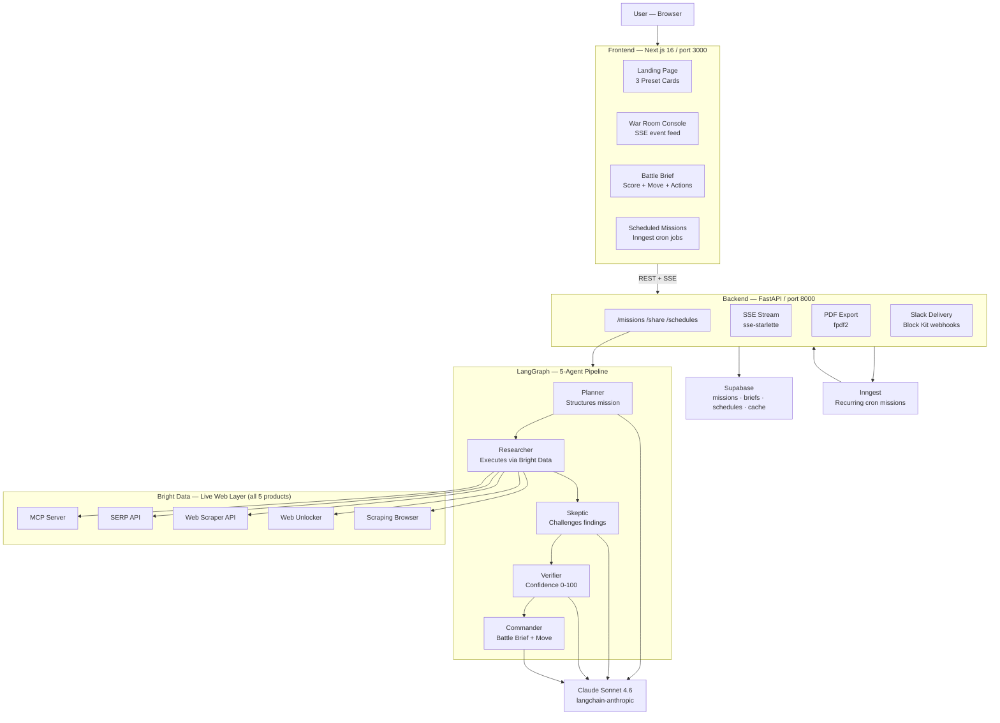

# WAR ROOM AI

```
██╗    ██╗ █████╗ ██████╗     ██████╗  ██████╗  ██████╗ ███╗   ███╗     █████╗ ██╗
██║    ██║██╔══██╗██╔══██╗    ██╔══██╗██╔═══██╗██╔═══██╗████╗ ████║    ██╔══██╗██║
██║ █╗ ██║███████║██████╔╝    ██████╔╝██║   ██║██║   ██║██╔████╔██║    ███████║██║
██║███╗██║██╔══██║██╔══██╗    ██╔══██╗██║   ██║██║   ██║██║╚██╔╝██║    ██╔══██║██║
╚███╔███╔╝██║  ██║██║  ██║    ██║  ██║╚██████╔╝╚██████╔╝██║ ╚═╝ ██║    ██║  ██║██║
 ╚══╝╚══╝ ╚═╝  ╚═╝╚═╝  ╚═╝   ╚═╝  ╚═╝ ╚═════╝  ╚═════╝ ╚═╝     ╚═╝   ╚═╝  ╚═╝╚═╝
```

**Autonomous Market Battlefield for Enterprise Decision-Making**

> 5 agents. 5 Bright Data products. 3 mission types. Executive Battle Brief in 15 seconds.


---

## The Problem

Fortune 500 companies have dedicated competitive intelligence teams, real-time data platforms, and armies of analysts watching the market around the clock. Every other company — the 99% — makes strategic decisions with stale data, manual Google searches, and gut instinct.

Today's options are broken: $120K/yr analyst firms deliver reports in weeks. Perplexity-style one-shot research returns summaries with no sources or actions. Bloomberg-style dashboards show historical data with no synthesis. None of them produce **decisive verdicts** — a move recommendation, a confidence score, an action you can execute before lunch.

The gap: nothing does autonomous, recurring, multi-source intelligence with an actionable verdict. Until now.

---

## The Solution

War Room AI deploys five autonomous agents against any target — a competitor, a supplier, a threat actor — and returns a concise **Executive Battle Brief** in under 15 seconds. Each brief includes:

- **Market Move Score** (0–100) — quantified urgency signal
- **Recommended Move** — ATTACK / DEFEND / ESCALATE / WAIT / MONITOR
- **Confidence Score** (0–100) — based on verified findings across 5 data sources
- **Action Pack** — Immediate / This Week / Watch actions you can execute today

Three mission types cover the three dimensions of enterprise risk.

---

## Why This is Only Possible with Bright Data

This is the most important section. Every mission exercises all five Bright Data products simultaneously. The **Bright Data Coverage panel** in the UI proves it in real time.

| Bright Data Product | Role in War Room | Without It |
|---|---|---|
| **SERP API** | Cross-engine signal discovery across Google, Bing, and regional engines — competitor mentions, news events, pricing changes, hiring signals | Limited to single engine, easily blocked, no cross-engine coverage |
| **Web Scraper API** | 660+ pre-built structured extractors (LinkedIn, Crunchbase, G2, Yahoo Finance, SEC EDGAR) — clean, schema-validated intelligence | Build and maintain 660 scrapers manually; each breaks when the site changes |
| **Web Unlocker** | Bypass bot detection, CAPTCHAs, and geo-blocks to reach protected press rooms, IR pages, trust portals, and enforcement records | Get 403'd by roughly half the web's most intelligence-rich pages |
| **Scraping Browser** | Render JS-heavy SPAs, dynamic pricing tiers, and SPA-gated dashboards that static scrapers cannot see | Headless Chrome fights anti-bot countermeasures daily; loses without residential proxy backbone |
| **MCP Server** | Agentic navigation for unstructured exploration — the Researcher calls Bright Data tools the same way Claude Desktop would | Build custom MCP scaffolding, stdio subprocess management, and tool routing from scratch |

> "A purely API-based agent would be blind to roughly 70% of the live web — the part that sits behind bot protection, JavaScript rendering, or geographic blocks. All five Bright Data products together close that gap."

---

## The 3 Flagship Missions — All 3 Hackathon Tracks

| Mission | Hackathon Track | Demo Target | Actual Result | Sample Brief |
|---|---|---|---|---|
| **Account Pulse** | Track 1 — GTM Intelligence | anthropic.com | DEFEND 72 · Confidence 78 | [View brief](docs/sample-briefs/anthropic-account-pulse.md) |
| **Supplier Watch** | Track 2 — Finance & Market Intelligence | boeing.com | DEFEND 72 · Confidence 78 | [View brief](docs/sample-briefs/boeing-supplier-watch.md) |
| **Threat Surface** | Track 3 — Security & Compliance | change.unitedhealthgroup.com | DEFEND 71 · Confidence 78 | [View brief](docs/sample-briefs/change-healthcare-threat-surface.md) |

These are **real briefs** generated by the live system against real targets. They are not mocked. Click "Deploy agents" on any preset card to regenerate one in real time.

---

## The 5 Agents

```
PLANNER → RESEARCHER → SKEPTIC → VERIFIER → COMMANDER
```

| Agent | Role | Key Output |
|---|---|---|
| **Planner** | Parses target + mission type into a structured 5-step research plan; assigns the right Bright Data product to each step | Typed research plan with tools, queries, and goals |
| **Researcher** | Executes all 5 plan steps in parallel via Bright Data; captures latency, status, and raw content per call | Raw findings corpus with per-product usage log |
| **Skeptic** | Adversarially challenges the findings — what's missing, what's unverified, what contradicts other signals | Challenge list with confidence impact per finding |
| **Verifier** | Resolves each challenge with additional evidence; assigns 0–100 confidence to the overall finding set | Verified claims, confidence score, coverage gaps |
| **Commander** | Synthesizes the Executive Battle Brief using the verified findings | Market Move Score · Recommended Move · Action Pack |

Wall time: **sub-13 seconds** for a full 5-agent run with 5/5 Bright Data products active.

---

## Sample Battle Brief — Anthropic Account Pulse

```
═══════════════════════════════════════════════════════════
EXECUTIVE BATTLE BRIEF · ACCOUNT PULSE
Target: anthropic.com · Generated 2026-05-28 · DEFEND 72/78
═══════════════════════════════════════════════════════════

MARKET MOVE SCORE     72 / 100
RECOMMENDED MOVE      DEFEND
CONFIDENCE            78 / 100

SITUATION
Anthropic has secured $2.5B+ in new funding and expanded its
Claude API with dual-cloud distribution (AWS Bedrock + GCP
Vertex AI). Enterprise sales velocity is accelerating. Amazon
investment gives Anthropic infrastructure at scale competitors
cannot immediately match. Any account considering or using
Claude-based tooling should lock in contracts now before
enterprise pricing tiers shift upward with market position.

IMMEDIATE
→ Accelerate any open Claude API contract negotiations — 
  pricing leverage window is 4-8 weeks before next re-rate
→ Benchmark Claude Sonnet 4.6 vs GPT-4o on your specific
  use cases today; document performance delta for procurement
→ Flag AWS/GCP budget owners: Bedrock/Vertex pricing may
  change when Anthropic reprices enterprise tiers

THIS WEEK
→ Review your AI vendor concentration risk — Anthropic's
  regulatory exposure (UK/EU AI Act) is non-zero
→ Monitor for Claude 4 release signals (job postings suggest
  pre-launch engineering sprint in progress)

WATCH
→ Anthropic safety incidents or regulatory enforcement actions
→ OpenAI pricing response to Anthropic enterprise expansion
→ Google DeepMind Gemini Ultra positioning vs Claude

BRIGHT DATA COVERAGE
SERP API ......... 2 calls  MCP Server ....... 1 call
Web Unlocker ..... 1 call   Scraper API ...... 1 call
Scraping Browser . 1 call   TOTAL ............ 6 calls
═══════════════════════════════════════════════════════════
```

See [full sample brief](docs/sample-briefs/anthropic-account-pulse.md) · [Boeing brief](docs/sample-briefs/boeing-supplier-watch.md) · [Change Healthcare brief](docs/sample-briefs/change-healthcare-threat-surface.md)

---

## Architecture



→ Full architecture notes: [ARCHITECTURE.md](./ARCHITECTURE.md)  
→ Bright Data integration deep-dive: [BRIGHT_DATA_USAGE.md](./BRIGHT_DATA_USAGE.md)

---

## Quickstart

> Requires: Node 20+, pnpm 10+, Python 3.11+, uv

```powershell
# Clone
git clone https://github.com/jpablortiz96/warroom-ai.git
cd warroom-ai

# Backend
cd api
uv sync
Copy-Item .env.example .env
# Fill in: ANTHROPIC_API_KEY, BRIGHT_DATA_API_TOKEN, SUPABASE_URL, SUPABASE_SERVICE_KEY
# Run Supabase migrations: supabase/schema.sql + scripts/create_scraper_cache.sql
#                           + scripts/create_mission_schedules.sql
uv run uvicorn main:app --reload --log-level warning

# Frontend (new terminal)
cd ..\web
pnpm install
pnpm dev
# Open http://localhost:3000

# Inngest scheduler (optional, new terminal)
npx inngest-cli@latest dev -u http://localhost:8000/api/inngest
```

### Environment variables

| Variable | Where to get it |
|---|---|
| `ANTHROPIC_API_KEY` | [console.anthropic.com](https://console.anthropic.com) |
| `BRIGHT_DATA_API_TOKEN` | Bright Data dashboard → Account → API token |
| `BRIGHT_DATA_SERP_ZONE` | Dashboard → SERP API → Zone name |
| `BRIGHT_DATA_UNLOCKER_ZONE` | Dashboard → Web Unlocker → Zone name |
| `BRIGHT_DATA_BROWSER_USER` / `_PASS` | Dashboard → Scraping Browser → Access Parameters |
| `BRIGHT_DATA_SCRAPER_DATASET_ID` | Dashboard → Web Scraper API → Dataset ID |
| `SUPABASE_URL` / `SUPABASE_SERVICE_KEY` | Supabase project → Settings → API |

---

## Features

| Feature | Status |
|---|---|
| 3 one-tap preset missions | ✅ Live |
| 5-agent LangGraph pipeline | ✅ Live |
| 5 Bright Data products — all parallel | ✅ Live |
| Real-time SSE agent event stream | ✅ Live |
| Bright Data Coverage panel (5 product cards) | ✅ Live |
| Executive Battle Brief with Market Move Score | ✅ Live |
| Copy as Markdown | ✅ Live |
| Download as PDF | ✅ Live |
| Public share link `/share/{id}` | ✅ Live |
| Send to Slack (Block Kit) | ✅ Live |
| Scheduled recurring missions | ✅ Live (Inngest) |
| Scraper API response cache | ✅ Live (Supabase) |

---

## Roadmap

- **Email delivery** — SMTP + templated alert emails for scheduled missions
- **Custom mission builder** — let users define new mission types beyond the 3 templates
- **Confidence-based re-runs** — if confidence < 60, auto-trigger 24h follow-up mission
- **CRM integrations** — push battle brief summaries to HubSpot, Salesforce, Snowflake
- **Self-hosted enterprise edition** — Docker Compose, bring-your-own Bright Data zones
- **Multi-target missions** — compare 3 competitors in a single brief

---

## Business Model

| Tier | Price | Includes |
|---|---|---|
| Pay-per-mission | $5 / mission | On-demand only |
| Growth | $299 / month | 100 missions/month + Slack delivery |
| Enterprise | Custom | Unlimited + custom missions + API access + SLA |

**Target ICP:** GTM leaders, supply chain teams, and security managers at Series B–D SaaS companies (50–500 employees) who need intelligence faster than they can hire analysts.

**TAM:** $18B competitive intelligence market, growing 11% YoY. 200K+ companies in the US alone that could use a $299/month intelligence platform.

---

## License

MIT — see [LICENSE](./LICENSE)

---

## Credits

- **[Bright Data](https://brightdata.com)** — the web data infrastructure that makes War Room's intelligence possible
- **[Anthropic](https://anthropic.com)** — Claude Sonnet 4.6, the LLM powering all 4 reasoning agents
- **[LangGraph](https://github.com/langchain-ai/langgraph)** — stateful multi-agent orchestration
- **[Inngest](https://inngest.com)** — durable scheduled function execution
- **[Supabase](https://supabase.com)** — open-source Postgres + realtime

---

*Built for the **Bright Data Web Data UNLOCKED Hackathon** · May 2026 · [github.com/jpablortiz96/warroom-ai](https://github.com/jpablortiz96/warroom-ai)*
